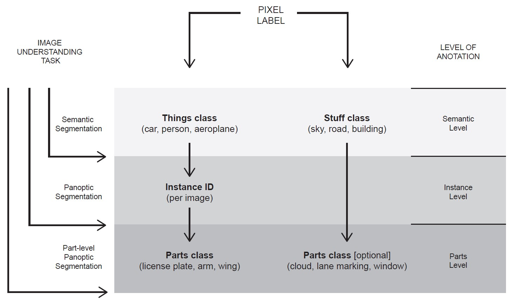

# Hierarchical panoptic format and labels encoding

Each pixel in our hierarchical label format has an up to 7-digit _universal id_ (_uid_) containing:

- An up to 2-digit _semantic id_ (_sid_), encoding the semantic-level _things_ or _stuff_ class.
- An up to 3-digit _instance id_ (_iid_), a counter of instances per _things_ class and per image. This is optional.
- An up to 2-digit _part id_ (_pid_), encoding the parts-level semantic class per-instance and per-image. This is optional, but if provided requires also an _iid_. Only _things_ parts are covered by this format.

We compactly encode the aforementioned _ids_ (_sid_, _iid_, _pid_) into an up to 7-digit _uid_, for which the first two digits (starting from the left) encode the semantic class, the next 3 encode the instance (after zero pre-padding), and the final two encode the parts class (after zero pre-padding).

The above encoding it is guaranted that:

- 1-2 digit _uids_ encode only semantic-level labels
- 4-5 digit _uids_ encode semantic-instance-level labels
- 6-7 digit _uids_ encode semantic-instance-parts-level labels

For example, in _Cityscapes-Panoptic-Parts_, a _sky_ (_stuff_) pixel will have _uid_ = 23, a _car_ (_things_) pixel that is labeled only on the semantic level will have _uid_ = 26, if it's labeled also on instance level it can have _uid_ = 26002, and a _person_ (_things_) pixel that is labeled on all three levels can have _uid_ = 2401002.

> The format does not cover parts-level classes for _stuff_ semantic classes for now.

## Unlabeled pixels

We handle the unlabeled / void / "do not care pixels" in the three levels as follows:

- Semantic level: For _Cityscapes-Panoptic-Parts_ we use the original Cityscapes void class. For _PASCAL-Panoptic-Parts_ we use the class with _uid_ = 0.
- Instance level: For instances the void class is not required. If a pixel does not belong to an object or cannot be labeled on instance level then it has only an up to 2-digit _semantic id_.
- Parts level: For both datasets we use the convention that, for each semantic class, the part-level class with _pid_ = 0 represents the void pixels, e.g., for a _person_ pixel, _uid_ = 2401000 represents the void parts pixels of instance 10. The need for a void class arises during the manual annotation process but in principle it is not needed at the parts level. Thus, we try to minimize void parts level pixels and assign them instead only the semantic- or semantic-instance -level labels.
