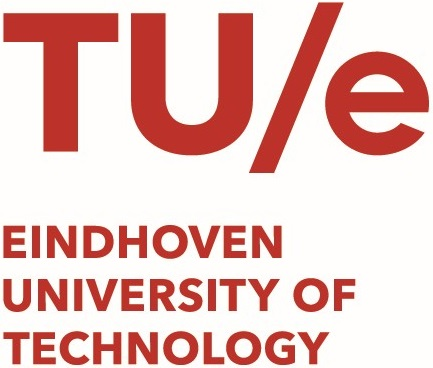

# Panoptic Parts datasets for Holistic Scene Understanding

[](https://panoptic-parts.readthedocs.io/en/latest/?badge=latest)

**v2.0 Release Candidate**

## [[CVPR 2021 Paper]()] [[Datasets Technical Report](https://arxiv.org/abs/2004.07944 "arxiv.org")] [[Documentation](https://panoptic-parts.readthedocs.io/en/stable)]

This repository contains code and tools for reading, processing, and visualizing Panoptic Parts datasets. Moreover, it contains code for reproducing CVPR 2021 paper results.

## Datasets

*Cityscapes-Panoptic-Parts* and *PASCAL-Panoptic-Parts* are created by extending two established datasets for image scene understanding, namely [Cityscapes](https://github.com/mcordts/cityscapesScripts "Cityscapes") and [PASCAL](http://host.robots.ox.ac.uk/pascal/VOC/voc2010/ "PASCAL") datasets. Detailed description of the datasets and various statistics are presented in our technical report in [arxiv](https://arxiv.org/abs/2004.07944 "arxiv.org"). The datasets can be downloaded from:

- [Cityscapes Panoptic Parts](https://www.cityscapes-dataset.com/login/)
- [PASCAL Panoptic Parts](https://1drv.ms/u/s!AojlpuGgPtL1bHXfIdeL14IeVhI?e=5tNfET)

### Examples

 | 
---- | ----
 |  |  | 

More examples [here](https://panoptic-parts.readthedocs.io/en/stable/visualization.html).

## Installation

The code can be used by installing the requirements and cloning the repository (at least Python 3.7 is needed). A pip package will be available soon.

```shell
git clone https://github.com/pmeletis/panoptic_parts.git
cd panoptic_parts
pip install -r requirements.txt
```

## API and code reference

We provide a public, stable API consisting, and various code utilities that are documented [here](https://panoptic-parts.readthedocs.io/en/stable/api_and_code.html).


## Citations

 Please cite us if you find our work useful and you use it for your research:

```bibtex
@article{degeus2021panopticparts,
    title = {Part-aware Panoptic Segmentation},
    author = {Daan de Geus and Panagiotis Meletis and Chenyang Lu and Xiaoxiao Wen and Gijs Dubbelman},
    booktitle = {IEEE/CVF Conference on Computer Vision and Pattern Recognition (CVPR)},
    year = {2021}
}
```

```bibtex
@article{meletis2020panopticparts,
    title = {Cityscapes-Panoptic-Parts and PASCAL-Panoptic-Parts datasets for Scene Understanding},
    author = {Panagiotis Meletis and Xiaoxiao Wen and Chenyang Lu and Daan de Geus and Gijs Dubbelman},
    type = {Technical report},
    institution = {Eindhoven University of Technology},
    date = {16/04/2020},
    url = {https://github.com/tue-mps/panoptic_parts},
    eprint={2004.07944},
    archivePrefix={arXiv},
    primaryClass={cs.CV}
}
```

<a href="https://www.tue.nl/en/research/research-groups/signal-processing-systems/mobile-perception-systems-lab"></a> &emsp; <a href="https://www.tue.nl"></a>
## Contact

Please feel free to contact us for any suggestions or questions.

**panoptic.parts@outlook.com**

The Panoptic Parts datasets team

Correspondence: Panagiotis Meletis, Vincent (Xiaoxiao) Wen
