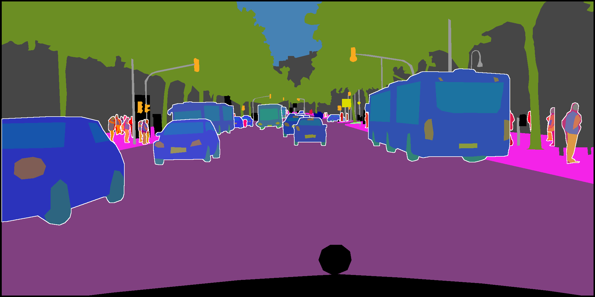

# Panoptic Parts datasets for Holistic Scene Understanding

[](https://panoptic-parts.readthedocs.io/en/latest/?badge=latest)

This repository contains code and tools for reading, processing, and visualizing *Cityscapes-Panoptic-Parts* and *PASCAL-Panoptic-Parts* datasets. We created these datasets by extending two established datasets for image scene understanding, namely [Cityscapes](https://github.com/mcordts/cityscapesScripts "Cityscapes") and [PASCAL](http://host.robots.ox.ac.uk/pascal/VOC/voc2010/ "PASCAL") datasets.

Detailed description of the datasets and various statistics are presented in our technical report in [arxiv](https://arxiv.org/abs/2004.07944 "arxiv.org"). Please cite us if you find our work useful and you use it for your research:

```bibtex
@article{meletis2020panopticparts,
    title = {Cityscapes-Panoptic-Parts and PASCAL-Panoptic-Parts datasets for Scene Understanding},
    author = {Panagiotis Meletis and Xiaoxiao Wen and Chenyang Lu and Daan de Geus and Gijs Dubbelman},
    type = {Technical report},
    institution = {Eindhoven University of Technology},
    date = {16/04/2020},
    url = {https://github.com/tue-mps/panoptic_parts},
    eprint={2004.07944},
    archivePrefix={arXiv},
    primaryClass={cs.CV}
}
```

<a href="https://www.tue.nl/en/research/research-groups/signal-processing-systems/mobile-perception-systems-lab"></a> &emsp; <a href="https://www.tue.nl"></a>

## Cityscapes-Panoptic-Parts

 | 
---- | ----
 | 

## PASCAL-Panoptic-Parts

 |  |  | 
---- | ---- | ---- | ----
 |  |  | 

## Code usage

We provide a public, backwards compatible API, which allows easier bug fixes and functionality updates. We suggest that the users update their local clone of this repository frequently by pulling the master branch. The list can be found here: [Public API](API.md).

All functions and arguments named with the preffix 'experimental_' or with an '_' do not
belong to the stable API and may change.

## Hierarchical format and labels encoding

We encode three levels of labels: semantic, instance, and parts in a single image-like file. The hierarchical panoptic encoding of the labels is explained here: [Label format](LABEL_FORMAT.md). Labels for both datasets follow this format.

## Ground Truth usage cases

We provide for each image a single (image-like) ground truth file encoding semantic-, instance-, and parts- levels annotations. Our compact [label format](LABEL_FORMAT.md) together with [_decode_uids_](panoptic_parts/utils/format.py) function enable easy decoding of the labels for various image understanding tasks including:

```Python
# labels: Python int, or np.ndarray, or tf.Tensor, or torch.tensor

# Semantic Segmentation
semantic_ids, _, _ = decode_uids(labels)

# Instance Segmentation
semantic_ids, instance_ids, _ = decode_uids(labels)

# Panoptic Segmentation
_, _, _, semantic_instance_ids = decode_uids(labels, return_sids_iids=True)

# Parts Segmentation / Parts Parsing
_, _, _, semantic_parts_ids = decode_uids(labels, return_sids_pids=True)

# Instance-level Parts Parsing
semantic_ids, instance_ids, parts_ids = decode_uids(labels)

# Parts-level Panoptic Segmentation
_, _, _, semantic_instance_ids, semantic_parts_ids = decode_uids(labels, return_sids_iids=True, return_sids_pids=True)

```

## Requirements

Tested with the following configuration (Linux system):

* Required
  * Python >= 3.7
  * numpy >= 1.15
  * Pillow >= 8.0
  * scipy >= 1.4
  * ruamel.yaml >= 0.15

* Optional
  * json (for saving evaluation results)
  * tensorflow >= 2.0 (for label format handling in Tensorflow)
  * torch >= 1.4 (for label format handling in PyTorch)
  * matplotlib >= 3.2 (for visualization scripts)
  * panopticapi (for merging)
  * pycocotools (for merging)

## Contact

Please feel free to contact us for any suggestions or questions.

**panoptic.parts@outlook.com**

The Panoptic Parts datasets team

Correspondence: Panagiotis Meletis, Vincent Wen
